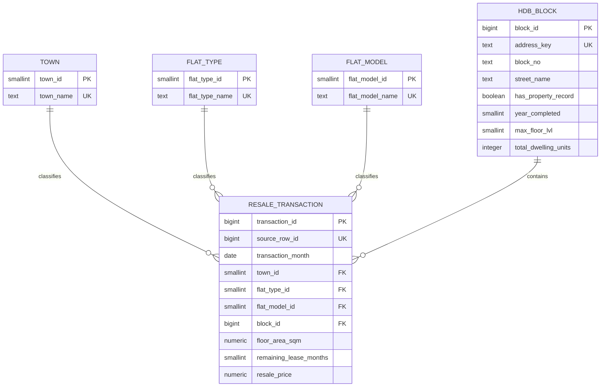

# Database Entity Relationship Diagram

```mermaid
erDiagram
    TOWN ||--o{ RESALE_TRANSACTION : classifies
    FLAT_TYPE ||--o{ RESALE_TRANSACTION : classifies
    FLAT_MODEL ||--o{ RESALE_TRANSACTION : classifies
    HDB_BLOCK ||--o{ RESALE_TRANSACTION : contains

    TOWN {
        smallint town_id PK
        text town_name UK
    }
    FLAT_TYPE {
        smallint flat_type_id PK
        text flat_type_name UK
    }
    FLAT_MODEL {
        smallint flat_model_id PK
        text flat_model_name UK
    }
    HDB_BLOCK {
        bigint block_id PK
        text address_key UK
        text block_no
        text street_name
        boolean has_property_record
        smallint year_completed
        smallint max_floor_lvl
        integer total_dwelling_units
    }
    RESALE_TRANSACTION {
        bigint transaction_id PK
        bigint source_row_id UK
        date transaction_month
        smallint town_id FK
        smallint flat_type_id FK
        smallint flat_model_id FK
        bigint block_id FK
        numeric floor_area_sqm
        smallint remaining_lease_months
        numeric resale_price
    }
```
